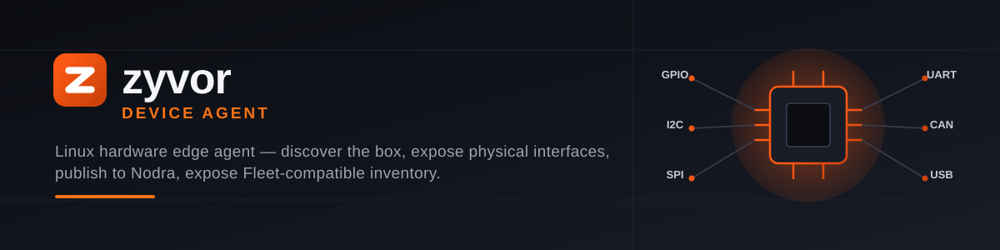
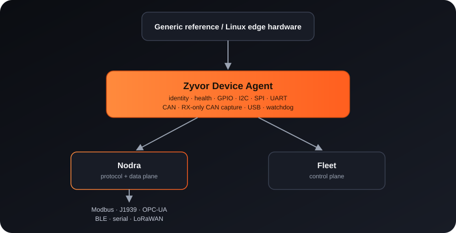

<p align="center">
  
</p>

<p align="center">
  
</p>

<p align="center">
  <a href="https://github.com/zyvorai/device-agent/actions/workflows/ci.yml"></a>
  <a href="LICENSE"></a>
  
  
  
</p>

> Linux hardware edge agent for Zyvor — discover the box, expose physical interfaces, publish to Nodra, expose Fleet-compatible inventory.

## Contents

- [Why this exists](#why-this-exists)
- [v0.1 scope](#v01-scope)
- [Quick start](#quick-start)
- [API](#api)
- [Documentation: guides, reference, architecture](#documentation)
- [Product boundary](#product-boundary)
- [Repository map](#repository-map)
- [License](#license)

<p align="center">
  
</p>

## Why this exists

Zyvor already has higher layers for workload/runtime control and fleet/data-plane responsibilities. What was missing was a small Linux-native hardware foundation that can run directly on an ARM64 gateway without Kubernetes. Device Agent provides that boundary.

It intentionally does **not** interpret Modbus registers, CAN/J1939 PGNs or OPC-UA nodes. It reports physical capabilities and gives sensor drivers a stable local contract. Nodra owns industrial protocol semantics, routing and offline store-and-forward. Fleet owns remote lifecycle and desired state. Aether can later consume the node capability model but is not required on the device.

## v0.1 scope

- ARM64 Linux first-class support
- CPU / RAM / root storage / OS / kernel / uptime / temperature inventory
- Ethernet / Wi-Fi / CAN network discovery
- read-only SocketCAN health: controller state, bitrate/CAN-FD bitrate and error counters
- passive serial/RS485 awareness from board config + Linux device tree
- disabled-by-default, RX-only SocketCAN frame capture on an explicit interface allowlist
- GPIO / I2C / SPI / UART / CAN / USB / watchdog discovery
- continuous cached inventory refresh + material hardware-change events
- sensor plugin process API + scheduled sampling
- real LM75/TMP102 I²C temperature reference plugin (explicit bus/address; no scanning)
- REST API
- Prometheus metrics endpoint
- Nodra MQTT publishing: retained inventory/status, per-sensor and event topics
- Fleet inventory bridge with hardware metadata and IP addresses
- systemd service
- OCI image with `linux/amd64` + `linux/arm64` CI
- local Apple-inspired dashboard using the same React/Vite family as Aether
- Generic reference-board profile + acceptance test

## Quick start

```bash
cp config/device-agent.example.toml /tmp/device-agent.toml
cargo run -- --config /tmp/device-agent.toml inventory
cargo run -- --config /tmp/device-agent.toml doctor
cargo run -- --config /tmp/device-agent.toml serve

# Reference sensor decode test; does not touch hardware
python3 examples/i2c_temperature.py --self-test
```

Dashboard/API: `http://127.0.0.1:9188`

Build the dashboard:

```bash
cd web/dashboard
npm ci
npm test
npm run build
```

## API

| Endpoint | Purpose |
|---|---|
| `GET /api/v1/health` | daemon liveness — process is up, always 200 |
| `GET /api/v1/ready` | readiness — 200 once the background inventory refresh loop is ticking, 503 if it has stalled |
| `GET /api/v1/status` | agent generation/sample counters |
| `GET /api/v1/inventory` | cached full device inventory |
| `GET /api/v1/hardware` | alias for `/api/v1/inventory` |
| `POST /api/v1/inventory/refresh` | force an immediate Linux inventory refresh |
| `GET /api/v1/interfaces` | network, buses, industrial state and USB |
| `GET /api/v1/industrial` | CAN + serial/RS485 hardware state |
| `GET /api/v1/industrial/can` | SocketCAN controller/netdevice health |
| `GET /api/v1/industrial/serial` | UART/USB serial and RS485 declarations |
| `GET /api/v1/can/capture` | read-only CAN capture status/counters |
| `GET /api/v1/can/frames/recent` | bounded recent captured CAN frame history |
| `GET /api/v1/can/frames/stream` | live Server-Sent Events stream of captured CAN frames |
| `GET /api/v1/thermal` | Linux thermal zones |
| `GET /api/v1/integrations` | Nodra/Fleet connection state |
| `GET /api/v1/integrations/fleet/inventory` | the same projection as the `fleet-inventory` CLI command, over HTTP |
| `GET /api/v1/plugins` | plugin manifests + validation state |
| `POST /api/v1/plugins/{name}/sample` | execute one plugin sample |
| `GET /api/v1/sensors` | latest canonical samples |
| `GET /api/v1/sensors/{sensor_id}` | latest sample for one sensor |
| `GET /api/v1/events` | live Server-Sent Events stream |
| `GET /api/v1/events/recent` | bounded recent event history |
| `GET /api/v1/doctor` | field diagnostics |
| `GET /metrics` | Prometheus text exposition |


## Industrial bus layer (v0.1.2)

Device Agent now enriches SocketCAN from Linux sysfs and optional read-only `ip -j -details -statistics` output. It surfaces `BUS-OFF`, nominal bitrate, CAN-FD data bitrate, controller error counters, netdevice counters, driver and physical/virtual classification. It never opens or decodes CAN frames.

RS485 discovery is deliberately passive. Declare the board port explicitly, or let Linux device-tree properties identify it:

```toml
[industrial]
can_ip_command = "ip"
rs485_ports = ["ttyS1"]
publish_to_nodra = true
```

Protocol meaning still belongs to Nodra. The proposed Modbus RTU adapter seam is documented in `docs/NODRA_MODBUS_RTU_CONTRACT.md`.

## Read-only CAN capture (v0.1.3)

Disabled by default. When enabled, Device Agent binds only the explicitly allowlisted SocketCAN interfaces on a receive-only raw socket — there is no transmit endpoint and capture never changes bitrate, CAN-FD mode, restart policy or controller state. Accepted frames are rate-limited per interface and kept in a bounded in-memory history.

```toml
[industrial.can_capture]
enabled = true
interfaces = ["can0"]
history_limit = 512
max_frames_per_second = 200
include_error_frames = false
publish_to_nodra = true
```

Raw frames (classic, extended, and CAN-FD with BRS/ESI flags) are available over REST/SSE and, when enabled, published to per-interface Nodra topics. Device Agent does not decode J1939 PGNs — see `docs/CAN_CAPTURE.md` and `docs/NODRA_J1939_HANDOFF.md` for the hand-off to Nodra's `j1939-device-agent` connector.

## API auth and Unix socket (v0.1.4)

The API is unauthenticated by default (`auth.mode = "none"`), matching v0.1.0–v0.1.3. Set
`auth.mode = "bearer"` to require `Authorization: Bearer <token>` on every `/api/*` route
and on `/metrics`, except `auth.exempt_paths` (`/api/v1/health` and `/api/v1/ready` by
default, so probes never need a token — note
`/metrics` is **not** exempt). The bundled dashboard's static shell (everything outside
`/api/*`/`/metrics`) is always unauthenticated, regardless of `auth.mode` — it carries no
device data, and needs to load before it can show its own token prompt. The daemon never
stores the raw token, only its SHA-256 hash:

```toml
[auth]
mode = "bearer"
exempt_paths = ["/api/v1/health", "/api/v1/ready"]

[auth.bearer]
token_hash_file = "/etc/zyvor/device-agent/auth/bearer.sha256"
```

`./scripts/deploy-remote.sh HOST --auth-mode bearer` generates the token and installs the
hash automatically (same pattern as `../fabric`'s admin-password bootstrap), and prints a
ready-to-paste Prometheus scrape-config snippet for `/metrics` (which requires the same
bearer token — Prometheus supports this natively via the `authorization:` scrape-config
block, no code-side change needed):

```yaml
scrape_configs:
  - job_name: zyvor-device-agent
    static_configs:
      - targets: ['HOST:9188']
    authorization:
      type: Bearer
      credentials: <token>
```

The bundled dashboard (`web/dashboard`) also understands bearer auth: it prompts for a token
on first load against a bearer-protected agent (stored in that browser's `localStorage`
only), and re-sends it on every request. The two SSE streams (`/api/v1/events`,
`/api/v1/can/frames/stream`) additionally accept the token as a `?token=` query parameter,
since browsers' `EventSource` API cannot set custom headers — this fallback is scoped to
just those two routes and is never accepted in place of the header for any other route.

A second, additive API listener over a Unix domain socket is available for same-host callers
(Fleet, Nodra) that would rather use kernel peer-credential checks than carry a token:

```toml
[server.unix_socket]
enabled = true
path = "/run/zyvor-device-agent/api.sock"
allow_uids = [1000]
allow_gids = []
```

Empty `allow_uids`/`allow_gids` deny everyone — both must be explicitly populated.

## mTLS enrollment (v0.1.4)

`auth.mode = "mtls"` moves auth to the TLS layer: the daemon terminates TLS with its own
issued certificate and, with `require_client_cert = true`, rejects any connection whose
client certificate isn't signed by `auth.mtls.client_ca_file` — at the handshake, before
the request reaches application code. `zyvor-device-agent enroll` generates a keypair and
CSR and submits them to `enrollment.server_url`; Device Agent implements only this client
side of the handshake and never signs certificates itself — see
`docs/MTLS_ENROLLMENT.md` for the protocol and why. `serve` refuses to start in `mtls` mode
until `enroll` has run; `zyvor-device-agent identity` prints the current certificate's
subject, issuer and validity, plus which key backend produced it.

`identity.backend = "tpm"` (optional, `--features tpm2`) generates and signs that private
key inside a TPM2 instead of a PKCS#8 file, falling back to software at runtime if the TPM
can't be opened — see `docs/TPM2_IDENTITY.md`.

## CORS and rate limiting (v0.1.4)

Both apply only to the TCP listener (not the Unix socket, where neither concept applies):

```toml
[server.cors]
enabled = false          # off by default — the bundled dashboard is same-origin
allowed_origins = []

[server.rate_limit]
enabled = true           # on by default — pure DoS protection, no behavior change
requests_per_second = 20 # per peer IP
burst = 40
```

CORS is opt-in: only needed for a dashboard/integration served from a different origin
than the agent itself. Rate limiting defaults on with generous limits since it only ever
affects abusive traffic, not normal usage.

## TLS (v0.1.5, optional)

Off by default. `server.tls.enabled` serves plain HTTPS on the same TCP listener — unlike
`auth.mode = "mtls"`, no client certificate is ever required, so an ordinary browser can
reach `https://<host>:9188/` directly with no extra setup:

```toml
[server.tls]
enabled = true
cert_path = "/etc/zyvor/device-agent/tls/server.crt"
key_path = "/etc/zyvor/device-agent/tls/server.key"
```

If no cert exists at those paths, one is generated automatically on first start (a
self-signed cert covering `localhost`/`127.0.0.1`/`::1`/hostname/detected local IP) — a
browser will show a trust warning until you accept it or replace the cert with a real one
by mounting it at the same paths, which is never overwritten if already present.
Independent of `auth.mode`: enabling TLS doesn't change who can call the API, only
whether the connection is encrypted, so pair `server.tls.enabled = true` with
`auth.mode = "bearer"` for anything beyond a loopback bind. `auth.mode = "mtls"` still
takes its own separate TLS path (see the mTLS section above) rather than this one, since
that mode ties TLS to client-certificate verification.

## Configurable health thresholds (v0.1.4)

Off by default. When enabled, thermal zones and SocketCAN controller error counters are
checked against configured levels once per inventory-refresh tick, emitting
`threshold.breached`/`threshold.recovered` on the SSE event stream (and the Nodra
agent-event topic, if `nodra.enabled`) only on the edge transition — not every tick a
value stays over/under a level:

```toml
[thresholds]
enabled = true
thermal_warn_celsius = 75.0
thermal_critical_celsius = 90.0
can_error_counter_warn = 96      # CAN error-warning, per the CAN spec
can_error_counter_critical = 128 # CAN error-passive, per the CAN spec
```

## Config hot-reload (v0.1.4)

`SIGHUP` re-reads the config file and applies `auth.*`, `thresholds.*`,
`plugins.*`, `fleet.*`, and the parts of `industrial.*`/`nodra.*` that are
read fresh on each request/tick — without a restart:

```bash
sudo systemctl kill -s HUP zyvor-device-agent
```

`server.listen`, `server.unix_socket.*`, and `server.dashboard_dir` are bound
once at startup and can't be rebound live; changing one of those and sending
`SIGHUP` applies everything else but logs a warning that a full restart is
still needed for those specific fields. Likewise, `nodra.*` (the MQTT
connection itself) and `industrial.can_capture.*` (which interfaces the
capture threads have open) are only read once at their own startup — a
reload updates `state.config` for everything else, but reconnecting Nodra or
re-opening CAN capture sockets still needs a restart. A malformed config file
is logged and ignored on `SIGHUP`, keeping the daemon on its last-known-good
config rather than crashing or half-applying a broken reload.

## Packaging (v0.1.4)

Signed `.deb` and `.rpm` packages (amd64) are attached to each GitHub Release,
alongside the existing tarballs. Both install the same layout as
`scripts/install.sh` (`/usr/bin/zyvor-device-agent`,
`/usr/lib/systemd/system/zyvor-device-agent.service`,
`/etc/zyvor/device-agent.toml`, profiles, and the disabled-by-default I2C
reference plugin) but deliberately **do not** enable or start the service —
that stays an explicit `systemctl enable --now zyvor-device-agent` after
reviewing the config, matching `install.sh`'s own philosophy.
`/etc/zyvor/device-agent.toml` is a conffile (dpkg)/`%config(noreplace)`
(rpm): a locally-modified config survives a package upgrade or reinstall, and
`dpkg -r`/`rpm -e` leave it and the profiles/plugin manifests in place rather
than deleting them. arm64 packages aren't built yet — see `docs/BACKLOG.md`.

```bash
sudo dpkg -i zyvor-device-agent_*.deb   # or: sudo rpm -i zyvor-device-agent-*.rpm
sudo systemctl enable --now zyvor-device-agent
```

Multi-arch (`linux/amd64` + `linux/arm64`) container images are published
to `ghcr.io/zyvorai/device-agent` on every tagged release — the fastest
path onto a small ARM64 device with no on-device Rust/Node build:

```bash
podman pull ghcr.io/zyvorai/device-agent:latest
```

See [7. Container deployment](docs/guides/07-container-deployment.md) for
device/bus flags, config/state volumes, and running it under systemd.

## Hotplug (v0.1.4, optional)

`--features hotplug` adds a raw `NETLINK_KOBJECT_UEVENT` socket alongside the existing
polling inventory refresh (`device.inventory_refresh_seconds`, default 5s): a kernel uevent
for a bus the inventory tracks (`gpio`/`i2c`/`spidev`/`net`/`usb`/`tty`) triggers an
immediate re-scan instead of waiting for the next poll tick. Deliberately **not**
`udev`/`libudev.so` — this reads the same kernel-generated events udev does, without adding
a runtime library dependency the container image/`.deb`/`.rpm` don't otherwise need.
Off by default; opening the netlink socket is never fatal to the daemon — if it fails for
any reason, a warning is logged once and the daemon falls back to polling-only.

## Product boundary

```text
Device Agent: "There is a CAN interface named can0."
Nodra:        "0x18FF50E5 is engine temperature = 82°C."
Fleet:        "Apply config X to device ZY-REF-0001 and restart workload Y."
Aether:       "This application requires CAN + 4 cores; this node is eligible."
```

This separation is a design rule, not just an implementation detail.

## UX principles

The dashboard is a **local hardware cockpit**. It opens on one screen showing device identity, health, CPU/RAM/temperature, detected physical interfaces, and Nodra/Fleet status. The visual language is intentionally minimal: system typography, white space, glass-like navigation, monochrome surfaces, dark diagnostics, and Zyvor orange used only for emphasis.

Pages: **Overview · Hardware · Interfaces · Industrial · Sensors · Integrations · Diagnostics · Settings**.

## Repository map

```text
src/                    Rust daemon
  hardware/             Linux/sysfs discovery only (+ optional hotplug.rs)
  auth/                 bearer/mTLS auth, enrollment
  identity/             mTLS private key backends (software, optional tpm)
  integrations/         Nodra and Fleet adapters
  api.rs                 REST API
  plugins.rs             external sensor plugin contract
web/dashboard/           React + TypeScript + Vite UX
config/                  runtime configuration
packaging/systemd/       Linux service
examples/                plugin examples
scripts/                 packaging helpers
docs/                    architecture, roadmap, reference-hardware profile
.github/workflows/       CI and tagged release pipeline
```

## First demo acceptance test

A clean ARM64 reference unit must be able to: install one Zyvor package → start the agent → auto-detect hardware → read one real sensor through a plugin → publish through Nodra → keep working during WAN loss → sync after reconnect through Nodra WAL → appear in Fleet through the existing fleet-agent → expose health for remote lifecycle operations.

See the [Documentation](#documentation) section below for the full walkthrough, from first boot to Fleet enrollment.

## Documentation

New to Device Agent? Start with the tutorials — they're narrative, step-by-step
walkthroughs. Already know what you're doing and just need a fact? Jump
straight to the reference doc.

### Tutorials — `docs/guides/`

A numbered series meant to be read in order the first time through; see
[`docs/guides/README.md`](docs/guides/README.md) for the index.

| # | Guide | Covers |
|---|---|---|
| 1 | [Getting started](docs/guides/01-getting-started.md) | Build from source, run `inventory`/`doctor`/`serve`, open the dashboard |
| 2 | [Configuration & the API](docs/guides/02-configuration-and-api.md) | `device-agent.toml`, REST endpoints, `/metrics`, dashboard ↔ API mapping |
| 3 | [Securing your agent](docs/guides/03-securing-your-agent.md) | Choosing none / bearer / mTLS / Unix socket, CORS, rate limiting |
| 4 | [Industrial buses](docs/guides/04-industrial-buses.md) | CAN health, RS485 declaration, enabling read-only CAN capture |
| 5 | [Writing a sensor plugin](docs/guides/05-writing-a-sensor-plugin.md) | The plugin contract end to end, using the I²C temperature example |
| 6 | [Deploying to production](docs/guides/06-deploying-to-production.md) | `.deb`/`.rpm`, `deploy-remote.sh`, systemd, `SIGHUP` reload, Prometheus |
| 7 | [Container deployment](docs/guides/07-container-deployment.md) | Pull the published multi-arch image and run it, with or without systemd |

### How-to / reference

- **Hardware & acceptance** — [`REFERENCE_HARDWARE.md`](docs/REFERENCE_HARDWARE.md), [`V0.1.1_LIVE_HARDWARE.md`](docs/V0.1.1_LIVE_HARDWARE.md), [`HARDWARE_PERMISSIONS.md`](docs/HARDWARE_PERMISSIONS.md), [`INDUSTRIAL_ACCEPTANCE.md`](docs/INDUSTRIAL_ACCEPTANCE.md)
- **Industrial buses & protocol hand-off** — [`INDUSTRIAL_BUSES.md`](docs/INDUSTRIAL_BUSES.md), [`CAN_CAPTURE.md`](docs/CAN_CAPTURE.md), [`NODRA_J1939_HANDOFF.md`](docs/NODRA_J1939_HANDOFF.md), [`NODRA_MODBUS_RTU_CONTRACT.md`](docs/NODRA_MODBUS_RTU_CONTRACT.md)
- **Security & identity** — [`MTLS_ENROLLMENT.md`](docs/MTLS_ENROLLMENT.md), [`TPM2_IDENTITY.md`](docs/TPM2_IDENTITY.md)
- **Plugins** — [`PLUGIN_PROTOCOL.md`](docs/PLUGIN_PROTOCOL.md)
- **Operations** — [`QUICKSTART.md`](docs/QUICKSTART.md) (systemd + bearer-auth deployment path)

### Architecture & planning

- [`ARCHITECTURE.md`](docs/ARCHITECTURE.md) — full security-model picture and what's still open before GA
- [`ROADMAP.md`](docs/ROADMAP.md) / [`BACKLOG.md`](docs/BACKLOG.md) — where this is headed
- [`CONTRIBUTING.md`](CONTRIBUTING.md) / [`SECURITY.md`](SECURITY.md) / [`CHANGELOG.md`](CHANGELOG.md)

## License

### Open source (Apache-2.0)

This repository is licensed under the [Apache License, Version 2.0](LICENSE).
You may use, modify, and run it for personal, lab, and commercial production
use at no charge, subject to Apache-2.0 (preserve notices / NOTICE where required).
See [NOTICE](NOTICE).

### Enterprise

Production support, SLAs, and Zyvor Enterprise products are licensed separately.
Contact [sales@zyvor.dev](mailto:sales@zyvor.dev) or see [zyvor.dev](https://zyvor.dev).
