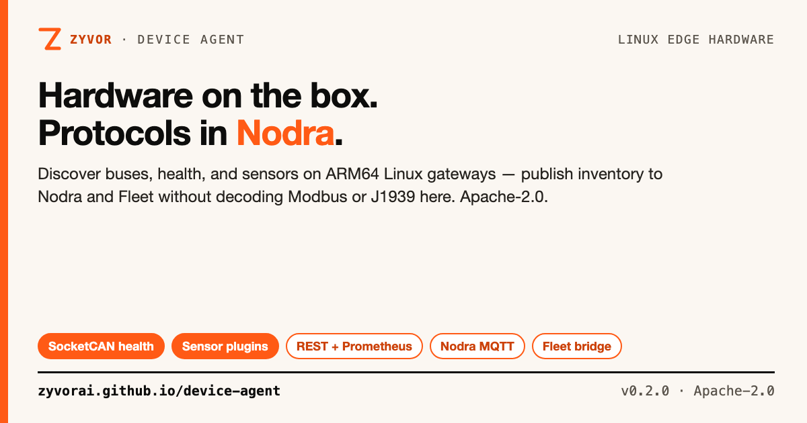

# Zyvor Device Agent

[](https://github.com/zyvorai/device-agent/actions/workflows/ci.yml)
[](LICENSE)
[](https://www.rust-lang.org/)
[](docs/REFERENCE_HARDWARE.md)



**Hardware on the box. Protocols in Nodra.**

📖 **[Read the full docs](https://zyvorai.github.io/device-agent/)** — tutorials, API reference, industrial buses, security, and production deployment.

Linux-native edge agent for Zyvor: discover the gateway, expose physical interfaces and health, run sensor plugins, publish inventory to Nodra, and bridge Fleet-compatible metadata. It does **not** decode Modbus, J1939, or OPC-UA — that stays in Nodra. Fleet owns remote lifecycle; Axiom can consume the capability model later but is not required on the device.

> **Maturity (honest):** **v0.2.0 — passport and flight recorder** — serious ARM64-first hardware layer with REST, Prometheus, optional bearer/mTLS/Unix API, read-only CAN capture, packaging, and a local dashboard. Not a home-automation hub, container fleet, or protocol decoder. Capability profile, not a certified SKU list: see [`docs/REFERENCE_HARDWARE.md`](docs/REFERENCE_HARDWARE.md).

New here? [`docs/FAQ.md`](docs/FAQ.md) · [`docs/TROUBLESHOOTING.md`](docs/TROUBLESHOOTING.md)

## Contents

- [Why this exists](#why-this-exists)
- [Is this for you?](#is-this-for-you)
- [Capabilities](#capabilities)
- [Quick start](#quick-start)
- [API](#api)
- [Product boundary](#product-boundary)
- [Documentation](#documentation)
- [Repository map](#repository-map)
- [License](#license)

## Why this exists

Zyvor already has workload/runtime and fleet/data-plane layers. Device Agent fills the missing piece: a small daemon that runs directly on an ARM64 gateway **without Kubernetes**, reporting what the box actually has and giving sensor drivers a stable local contract.

```text
Device Agent: "There is a CAN interface named can0."
Nodra:        "0x18FF50E5 is engine temperature = 82°C."
Fleet:        "Apply config X to device ZY-REF-0001 and restart workload Y."
```

## Is this for you?

| | **Device Agent** | Home Assistant | balena | AWS IoT Greengrass | Azure IoT Edge |
|---|---|---|---|---|---|
| Primary scope | Hardware inventory, health, bounded bus access | Home automation hub | Fleet OS + container OTA | Cloud edge runtime | Cloud edge runtime |
| Cloud dependency | None — Nodra/Fleet optional | None | balenaCloud for fleet | AWS IoT Core | Azure IoT Hub |
| Industrial protocol decoding | Out of scope → Nodra | Community integrations | Not built-in | Custom components | Custom modules |
| Fleet/OTA | Out of scope → Fleet | Not built-in | Core feature | Via AWS | Via Azure |

*(General characterizations — verify against each project's docs.)*

## Capabilities

- **Inventory** — CPU, RAM, storage, OS, kernel, uptime, thermal; GPIO, I²C, SPI, UART, CAN, USB, watchdog; continuous refresh + material change events.
- **Industrial** — SocketCAN health (bitrate, CAN-FD, error counters); passive RS485 awareness; optional read-only CAN capture on an allowlist ([`docs/CAN_CAPTURE.md`](docs/CAN_CAPTURE.md)).
- **Sensors** — External plugin process API + scheduled sampling; reference LM75/TMP102 I²C plugin.
- **Integrations** — Nodra MQTT (retained inventory, events); Fleet inventory bridge; optional camera streaming (`--features camera`).
- **Operations** — REST + Prometheus; local React dashboard; systemd + `.deb`/`.rpm`/OCI; bearer, mTLS, Unix socket, TLS, hot-reload (`SIGHUP`) for much of config — see [guides 03–08](docs/guides/README.md).

Deep dives: [`docs/ARCHITECTURE.md`](docs/ARCHITECTURE.md), [`docs/INDUSTRIAL_BUSES.md`](docs/INDUSTRIAL_BUSES.md), [`docs/NODRA_J1939_HANDOFF.md`](docs/NODRA_J1939_HANDOFF.md), [`docs/NODRA_MODBUS_RTU_CONTRACT.md`](docs/NODRA_MODBUS_RTU_CONTRACT.md).

## Quick start

```bash
cp config/device-agent.example.toml /tmp/device-agent.toml
cargo run --bin agentctl -- --config /tmp/device-agent.toml status
cargo run -- --config /tmp/device-agent.toml doctor
cargo run -- --config /tmp/device-agent.toml serve
```

Dashboard/API: `http://127.0.0.1:9188`

```bash
make ci              # fmt, clippy, tests, release build
make deploy-remote H=<host> U=sus ARGS='--quick --no-ui'
podman pull ghcr.io/zyvorai/device-agent:latest   # tagged releases
```

## API

| Endpoint | Purpose |
|---|---|
| `GET /api/v1/health` · `GET /api/v1/ready` | Liveness / readiness |
| `GET /api/v1/inventory` · `POST …/refresh` | Cached hardware inventory |
| `GET /api/v1/interfaces` · `GET /api/v1/industrial` | Network, buses, CAN/serial state |
| `GET /api/v1/can/capture` · `…/frames/recent` · `…/stream` | Read-only CAN capture |
| `GET /api/v1/plugins` · `POST …/{name}/sample` | Sensor plugins |
| `GET /api/v1/sensors` · `GET /api/v1/events` | Samples and SSE events |
| `GET /api/v1/integrations` | Nodra/Fleet connection state |
| `GET /metrics` | Prometheus exposition |

Full table and auth behavior: [`docs/guides/02-configuration-and-api.md`](docs/guides/02-configuration-and-api.md).

## Product boundary

This separation is a design rule, not an implementation accident. Protocol meaning, routing, and offline store-and-forward belong to **Nodra**. Desired state and rollouts belong to **Fleet**.

## Documentation

Start with the numbered **[tutorial series](docs/guides/README.md)** (getting started → production/container). Reference: [`docs/FAQ.md`](docs/FAQ.md), [`docs/ROADMAP.md`](docs/ROADMAP.md), [`CONTRIBUTING.md`](CONTRIBUTING.md), [`SECURITY.md`](SECURITY.md).

## Repository map

```text
src/                 Rust daemon (hardware/, auth/, integrations/, api.rs, plugins.rs)
web/dashboard/       React + Vite local cockpit
config/              Runtime TOML
packaging/           systemd, container
docs/guides/         Step-by-step tutorials
docs/social/         Share cards (./docs/social/build-social-card.sh)
```

## License

Apache-2.0 — see [LICENSE](LICENSE) and [NOTICE](NOTICE). Enterprise support: [sales@zyvor.dev](mailto:sales@zyvor.dev) · [zyvor.dev](https://zyvor.dev).
